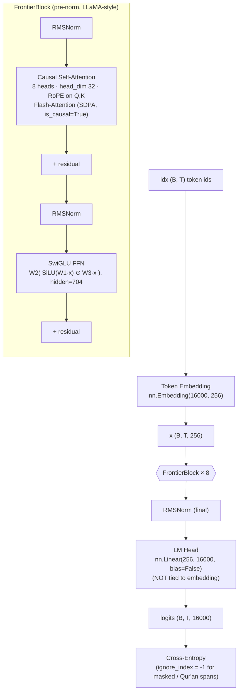

# MiniFrontier: A 14.6M-Parameter Monolingual Arabic Language Model — Empirical Analysis and a Scaling Proposal for v2 (50M)

**Technical research report — MiniFrontier project**
**Date:** 2026-06-23
**Scope:** Architecture review, v1 pre-training results, comparison with *Attention Is All You Need* (Vaswani et al., 2017) and the modern decoder-only stack, and a quantitatively-grounded design for a 50M-parameter v2.

---

## Abstract

MiniFrontier is a decoder-only causal language model of **14.62M parameters** trained from scratch **exclusively on Modern Standard Arabic (Fuṣḥā)**. The architecture is LLaMA-style (RMSNorm pre-norm, Rotary Position Embeddings, SwiGLU feed-forward, Flash-Attention) and departs in several well-motivated ways from the original 2017 encoder–decoder Transformer. The v1 run converged stably on a **170.7M-token** weighted Shamela corpus, reaching a category-weighted validation loss of **4.947 nats** (perplexity ≈ 141) after 655M training tokens (≈3.8 epochs). Qualitative inspection confirms clean sub-word decoding (the Metaspace tokenizer fix) and a mastered grammatical-*iʿrāb* register, but also reveals **degenerate looping** characteristic of a capacity- and data-limited regime. We diagnose the three dominant bottlenecks — **(i)** 56% of parameters are locked in the (untied) embedding/LM-head, leaving only 6.4M for actual computation; **(ii)** the corpus (170M unique tokens) is small relative to the model's appetite; **(iii)** GPU utilisation is **MFU ≈ 0.3%**, i.e. the training is dramatically launch/throughput-bound on the T4 — and we propose a **50M-parameter v2** with weight tying, `n_embd=512`, `n_layer=12`, a ~1B-token corpus, and a substantially larger micro-batch. Under Chinchilla-style scaling this configuration is internally consistent (≈20 tokens/parameter) and is projected to move validation loss from ≈4.95 toward the ≈3.5–4.0 band (perplexity ≈ 33–55), the threshold at which fluent, non-degenerate Arabic generation typically emerges at this scale.

---

## 1. Introduction

The goal of MiniFrontier is pedagogical and experimental: reproduce the full frontier-LLM pipeline — tokenizer → pre-training → alignment — at a scale that fits consumer hardware (RTX 3090 locally, Google Colab T4). The design bet is **monolingual specialisation**: at ~14M parameters, capacity is the binding constraint, so concentrating all of it on a single language (Arabic) is expected to beat a diluted multilingual model. This report (a) documents the v1 model and training, (b) situates it relative to the 2017 Transformer and the 2020–2024 decoder-only literature, and (c) turns the empirical results into a concrete v2 specification.

The user's stated objective — *"produce very correct Arabic text"* — is the lens throughout: we evaluate not just loss but the linguistic implications of each design choice (notably diacritic stripping, which trades morphological precision for vocabulary efficiency).

---

## 2. Background: the 2017 Transformer

Vaswani et al. (2017) introduced the Transformer as an **encoder–decoder** model for machine translation, with the following defining ingredients:

- **Multi-head scaled dot-product attention**, `Attention(Q,K,V) = softmax(QKᵀ/√d_k)V`, the sole sequence-mixing primitive (no recurrence, no convolution).
- **Sinusoidal absolute positional encodings** added to token embeddings.
- **Post-norm** residual blocks: `LayerNorm(x + Sublayer(x))`.
- **Position-wise FFN** with ReLU: `FFN(x) = max(0, xW₁+b₁)W₂+b₂`, inner dimension `d_ff = 4·d_model`.
- **Learned input/output embeddings with weight tying** between them, scaled by `√d_model`.
- Base configuration: `d_model=512`, `h=8` heads, `d_ff=2048`, 6 encoder + 6 decoder layers (~65M params).

Every component of MiniFrontier is a lineal descendant of this template, but **only the decoder half is retained** (a generative LM needs no encoder/cross-attention), and four of the six listed ingredients have been replaced by post-2017 improvements. The next section makes the deltas explicit.

---

## 3. MiniFrontier v1 architecture

### 3.1 Computational graph

### 3.2 Parameter budget (measured)

| Block | Formula | Params | Share |
|---|---|---:|---:|
| Token embedding | 16000 × 256 | 4.10M | 28.0% |
| LM head (untied) | 256 × 16000 | 4.10M | 28.0% |
| 8 × attention (Wq,Wk,Wv,Wo) | 8 × 4 × 256² | 2.10M | 14.4% |
| 8 × SwiGLU (W1,W2,W3) | 8 × 3 × 256 × 704 | 4.33M | 29.6% |
| RMSNorm + misc | — | ~0.01M | <0.1% |
| **Total** | | **14.62M** | 100% |

> **Headline finding #1.** The embedding + LM-head together account for **56.1%** of all parameters (8.20M of 14.62M). Only **6.42M parameters** perform actual contextual computation. Because the two matrices are **not tied** (LLaMA convention), a full 4.10M parameters are spent on a second copy of the vocabulary projection. At this scale that convention is *inverted* in cost-effectiveness (see §6.2).

### 3.3 Tokenizer and corpus

- **BPE, 16k vocab**, trained on the Arabic stream with a **Metaspace** pre-tokenizer/decoder (SentencePiece-style `▁` word-boundary marker). This replaced an earlier `Whitespace` pre-tokenizer that caused intra-word spaces on decode (`يرك ض` → now correctly `يركض`).
- **Aggressive Fuṣḥā normalisation**: NFC, tashkīl (short-vowel diacritics) removed, Alif/Ya/Waw forms unified, non-Arabic stripped. This collapses `كَتَبَ`/`كتب` to one token — vocabulary-efficient, but **lossy for morphology and poetic meter** (revisited in §5.4 and §7).
- **Corpus**: 170.7M training tokens + 4.1M validation tokens, drawn from a weighted Shamela manifest (classical grammar/morphology النحو والصرف, lexicons المعاجم, literature الأدب, poetry الشعر, rhetoric البلاغة, language اللغة). A **book-level train/val split** guarantees zero leakage, and **Qur'an spans `﴿…﴾` are loss-masked** (1.12% of train tokens) so the model reads but is not trained to *generate* scripture verbatim.

---

## 4. Architectural deltas vs. *Attention Is All You Need* (2017)

| Dimension | Transformer 2017 | MiniFrontier v1 | Why the change | Reference |
|---|---|---|---|---|
| Topology | Encoder–decoder | **Decoder-only** | Generative LM needs no source encoder/cross-attention | Radford et al. 2018/19 (GPT) |
| Normalisation | LayerNorm, **post-norm** | RMSNorm, **pre-norm** | Pre-norm stabilises deep residual training; RMSNorm drops the mean-centring → faster, equally stable | Xiong et al. 2020; Zhang & Sennrich 2019 |
| Positional info | **Sinusoidal absolute**, added to embeddings | **RoPE** (rotary), applied to Q,K only | Relative encoding, no learned params, supports context extrapolation | Su et al. 2021 (RoFormer) |
| FFN | ReLU, `d_ff=4·d` | **SwiGLU**, `d_ff≈(8/3)·d` | Gated activation beats ReLU/GELU at fixed compute on small models | Shazeer 2020 |
| Attention kernel | Dense `T×T` softmax matrix | **Flash-Attention** (fused SDPA, `is_causal=True`) | IO-aware, no materialised `T×T` matrix → memory & speed | Dao et al. 2022 |
| Bias terms | Present | **Removed** (Q/K/V/O, FFN, head) | ~1% fewer params, no quality loss at scale | Touvron et al. 2023 (LLaMA) |
| Embedding ↔ head | **Tied** + `√d_model` scale | **Untied**, std-0.02 init | Follows LLaMA; *but see §6.2 — counter-productive here* | Press & Wolf 2017; Touvron et al. 2023 |
| Residual init | — | Output proj. scaled by `1/√(2·n_layer)` | Keeps residual-stream variance bounded with depth | Radford et al. 2019 (GPT-2) |
| Optimiser | Adam, custom warmup-rsqrt | **AdamW** (fused), cosine warmup→decay, decoupled weight decay on 2D+ only | Decoupled WD generalises better; cosine is the modern default | Loshchilov & Hutter 2019 |

**Reading of the table.** MiniFrontier is essentially a *small LLaMA*: it keeps the 2017 attention mechanism intact (the dot-product core is untouched) and modernises everything *around* it. The single design choice that does **not** transfer cleanly to this scale is the untied embedding (§6.2).

---

## 5. v1 training results and analysis

### 5.1 Setup

- **Hardware:** Tesla T4 (14.56 GB), `float16` + GradScaler (mandatory — see DECISIONS BUG-06).
- **Effective batch:** 16 micro-batch × 8 grad-accum × 512 ctx = **65,536 tokens/step**.
- **Schedule:** AdamW, peak LR 1.5e-4, cosine to 1.5e-5, 400-step warmup, weight decay 0.1, grad-clip 1.0, 10,000 steps.
- **Tokens seen:** 655M (≈3.84 epochs over 170.7M unique).

### 5.2 Validation-loss trajectory (category-weighted, `ValW`)

| Step | 0 | 500 | 1000 | 2000 | 3000 | 4000 | 5000 | 6000 | 7000 | 8000 | 9000 | 9500 |
|---|---|---|---|---|---|---|---|---|---|---|---|---|
| ValW | 9.735 | 6.917 | 6.180 | 5.643 | 5.380 | 5.219 | 5.125 | 5.061 | 5.013 | 4.973 | 4.955 | **4.947** |
| ppl  | 16000 | 1009 | 483 | 282 | 217 | 185 | 168 | 158 | 150 | 145 | 142 | **141** |

The curve is **healthy and monotone**, with no overfitting divergence (train loss tracks val; `ckpt_best.pt` improved at every eval). But the **slope is flattening hard**: ΔValW over the last 2,500 steps (7000→9500) is only **−0.065**, against −0.74 over steps 2000→4500. The model is approaching its **capacity/data ceiling**, not a clean optimisation plateau — the loss is *still* descending at the final step, indicating it is simultaneously **under-trained and under-capacity** (a classic small-model signature: more data would help, but more parameters would help more).

### 5.3 Per-category validation loss (final)

| Category | نحو/صرف (grammar) | بلاغة (rhetoric) | معاجم (lexicons) | لغة (language) | أدب (literature) | شعر (poetry) |
|---|---:|---:|---:|---:|---:|---:|
| Loss (nats) | **4.666** | 4.839 | 4.976 | 5.254 | 5.353 | **5.717** |
| Perplexity | 106 | 126 | 145 | 191 | 211 | **304** |

Two clear signals:
- **Grammar/morphology is the model's strongest domain** (ppl 106) — unsurprising, it is the most up-weighted category (45% of the train mix) and the most formulaic register. The generation sample (`الفاعل مرفوع وعلامة رفعه الضمة الظاهرة…`) confirms a genuinely mastered *iʿrāb* style.
- **Poetry is by far the weakest** (ppl 304, ~3× grammar). This is partly under-weighting (2.5% of mix) but **structurally** the diacritic-stripping normalisation destroys the very signal poetry depends on — vocalisation, meter (*ʿarūḍ*), and rhyme. No amount of v1 scaling fixes poetry without revisiting normalisation (§7).

### 5.4 Qualitative diagnosis

The grammar prompt produces locally-correct Arabic but **degenerates into enumerated looping** (`اسم الفاعل: … اسم المفعول: … اسم الفاعل: …`). This is the canonical failure mode of an **under-capacity** model: it has learned strong local n-gram/morphological statistics (hence clean tokens and valid words) but lacks the representational depth to maintain long-range discourse structure, so it falls into high-probability attractor loops. Repetition penalty and nucleus sampling mask but do not cure this; **the fix is capacity + data**, exactly what v2 targets.

### 5.5 Hardware efficiency — the silent bottleneck

> **Headline finding #2.** Reported **MFU ≈ 0.3%** throughout. The T4 is essentially idle: at 14.6M params and `block_size=512`, each step is so cheap that the run is **kernel-launch / Python-overhead bound**, not compute-bound. At ~134k tok/s the run is fine in wall-clock terms (<1h), but it means **the same GPU could train a 3–5× larger model, or push a far larger batch, at almost no extra wall-clock cost.** This is the strongest argument that v2 is *free* on the throughput axis: there is enormous headroom before the T4 becomes the limit.

---

## 6. Why v1 is quality-limited: a scaling-law reading

### 6.1 Chinchilla / Kaplan accounting

Kaplan et al. (2020) and Hoffmann et al. (2022, *Chinchilla*) establish that, for compute-optimal training, **data should scale with parameters at roughly 20 tokens/parameter**.

| Model | Params (N) | Chinchilla-optimal data (20·N) | Unique data available | Tokens trained | Verdict |
|---|---:|---:|---:|---:|---|
| v1 | 14.6M | 292M | 170.7M | 655M | Data-*repeated* (3.8 ep); compute past optimal but **capacity-bound** |

v1 actually trains *past* its compute-optimal token count (655M ≫ 292M), which is the right call for an inference-deployed model (over-training a small model is cheap and helps). The problem is therefore **not** training length — it is that **14.6M parameters is simply too small** to drive loss below ~4.9 on this distribution, and that only 170M *unique* tokens exist to feed a larger model. Both must move together.

### 6.2 The weight-tying opportunity

Because embeddings dominate the v1 budget (56%), **tying the LM head to the input embedding** (Press & Wolf 2017; Inan et al. 2016) is the single highest-leverage change available:

- It **frees 4.1M parameters** (28% of the model) with negligible quality cost at small scale — at large scale LLaMA can afford untied heads because embeddings are a tiny fraction of the model, but here they are the *majority*.
- Those freed parameters can be **redeployed into depth/width**, where they do actual computation.
- It also tends to **regularise** small-vocab models and slightly speeds convergence.

This reframes the v2 question: *do not* spend the parameter increase on a third copy of the vocabulary — spend it on transformer blocks.

---

## 7. Proposed v2: a 50M-parameter Arabic model

### 7.1 Candidate configurations

All assume `vocab=16000`. `d_ff` follows the LLaMA `(8/3)·d` rule rounded to a multiple of 64.

| Config | n_embd | n_layer | n_head | hidden | Tied? | Total | Non-emb | Emb share | Chinchilla data (20·N) |
|---|---:|---:|---:|---:|---:|---:|---:|---:|---:|
| A | 512 | 10 | 8 | 1408 | no | 48.5M | 32.1M | 33.8% | 970M |
| B | 512 | 12 | 8 | 1408 | no | 54.9M | 38.5M | 29.8% | 1.10B |
| **C ★** | **512** | **12** | **8** | **1408** | **yes** | **46.7M** | **38.5M** | **17.5%** | **935M** |
| D | 640 | 12 | 10 | 1728 | yes | 69.7M | 59.5M | 14.7% | 1.39B |
| E | 512 | 14 | 8 | 1408 | yes | 53.1M | 45.0M | 15.4% | 1.06B |

> **Recommendation: Config C** (`n_embd=512, n_layer=12, n_head=8, hidden=1408, weight-tied`). At **46.7M total** it sits right on the "50M" target, yet thanks to tying it puts **38.5M parameters into actual computation — 6× the 6.4M of v1** — while keeping the embedding share to a healthy 17.5%. Its Chinchilla-optimal data (≈935M tokens) is a realistic corpus target. Config E (deeper, 14 layers) is the fallback if depth proves more valuable than head dimension in ablation; Config D is the "stretch" option if the corpus comfortably exceeds 1.2B tokens.

### 7.2 Architecture changes for v2

1. **Enable weight tying** (`lm_head.weight = tok_emb.weight`). Highest ROI single change. Update the "no weight tying" note in DECISIONS.md — the LLaMA rationale does not hold at this embedding share.
2. **`n_embd` 256 → 512, `n_layer` 8 → 12.** Doubling width quadruples attention/FFN params per layer and gives `head_dim=64` (vs 32) — 64 is the sweet spot for Flash-Attention kernels and a more expressive per-head subspace.
3. **Adopt GQA (Grouped-Query Attention)** (Ainslie et al. 2023) — the code is already "GQA-ready". Even at this scale it shrinks the KV-cache for inference at near-zero quality cost; e.g. 8 query heads / 2 KV heads. Optional for v2 but cheap to include.
4. **Keep RoPE, RMSNorm, SwiGLU, pre-norm, residual-scale init** — all validated, no change.
5. **Consider `block_size` 512 → 1024.** Longer context directly attacks the looping/degeneration failure (§5.4) by giving the model more discourse history; the T4 has ample memory headroom (§5.5).

### 7.3 Training-recipe changes

| Knob | v1 | v2 proposal | Rationale |
|---|---|---|---|
| Corpus (unique) | 170.7M | **≥ 0.9–1.0B tokens** | Match Chinchilla for 47M params; the #1 quality lever |
| Micro-batch | 16 | **48–96** (fit to VRAM) | MFU 0.3% ⇒ huge headroom; bigger batch = less gradient noise |
| Effective batch | 65.5k tok | **0.25–0.5M tok** | Larger, calmer gradients permit a higher LR |
| Peak LR | 1.5e-4 | **3e-4** (with the larger batch) | The 1.5e-4 cap existed *because* the 65k batch was noisy (BUG-06); a ~4–8× batch restores the nanoGPT-style 3e-4 regime |
| Steps | 10k | size to ~2–4 epochs over the new corpus | Avoid >4-epoch repetition (diminishing returns, memorisation) |
| Precision | fp16+scaler (T4) | bf16 on RTX 3090 / fp16 on T4 | Already auto-detected; prefer the 3090 for v2 |
| Dropout | 0.0 | 0.0, raise to 0.1 only if val/train gap widens | More data usually makes dropout unnecessary |

### 7.4 Corpus expansion (the gating dependency)

v2 is **bottlenecked by unique data, not by GPU**. Concrete sources to reach ~1B tokens of clean Fuṣḥā:
- **Hindawi** full collection (high-quality modern literary/academic Arabic).
- **Arabic Wikipedia** (current dump) + **Arabic Cosmopedia** (synthetic textbook-style, aligns with the "Textbooks Are All You Need" philosophy — Gunasekar et al. 2023).
- **Continued Shamela** breadth beyond the current categories.
- **Targeted synthetic generation** via the existing Ollama/vLLM lab (Qwen3) for under-represented registers (especially poetry-with-diacritics, see below).
- **De-duplicate** aggressively (MinHash/exact) before counting — repeated documents inflate the token count without adding signal.

### 7.5 The diacritics question (decisive for "very correct Arabic")

The user's goal is *correct* Arabic. v1's aggressive tashkīl stripping is the right call for vocabulary efficiency but **caps quality on exactly the dimensions that signal correctness**: case endings (*iʿrāb*), passive/active voice disambiguation, and all of poetry. Two paths for v2:
- **(Recommended, low-risk):** keep stripping for the *bulk* pre-training, but add a **diacritised sub-corpus** (e.g. fully-vocalised Qur'an *as input context*, classical vocalised poetry, Tashkeela corpus) so the model at least *sees* diacritics as in-vocabulary tokens. This requires loosening the normaliser to optionally retain harakāt and enlarging the vocab budget for them.
- **(Higher-ceiling, higher-cost):** train a **diacritisation-aware variant** where tashkīl are first-class tokens throughout. This roughly doubles sequence length and needs a larger vocab, but is the only route to genuinely "correct" vocalised output and competent poetry. Suitable as a v2.x experiment, not the main v2.

---

## 8. Projected outcome and success criteria

Under Config C + ~1B-token corpus + the recipe above, the scaling-law expectation is a validation loss in the **≈3.5–4.0 nats** band (perplexity ≈ 33–55) — roughly a **1.0-nat improvement** over v1's 4.95. Empirically, ~3.5–4.0 nats is the region where small Arabic LMs stop degenerate-looping and produce multi-sentence, topically-coherent prose. Concretely, treat v2 as successful when:

1. **`ValW ≤ 4.0`** (weighted) and **per-category poetry loss < 5.0** (vs 5.72 today).
2. **No degenerate looping** on the standard grammar/literature prompts at `temperature 0.7`, `rep_penalty 1.1`, over ≥150 generated tokens.
3. **MFU > 5%** (proof the larger model actually uses the GPU) — and ideally run v2 on the RTX 3090 in bf16.
4. The embedding share drops below 20% (structural confirmation that capacity went into computation, not vocabulary).

A small **ablation grid** before the full run will de-risk the architecture cheaply (each is a short T4/3090 run): {tied vs untied} × {12 vs 14 layers} × {block 512 vs 1024}, judged on val loss at a fixed 100M-token budget.

---

## 9. Conclusion

MiniFrontier v1 is a clean, correctly-engineered small LLaMA: the 2017 attention core is intact, every surrounding component is a justified modern upgrade, and the training run is stable and reproducible. Its quality is limited by three measurable factors — a parameter budget over half-consumed by an *untied* vocabulary projection, a 170M-token corpus, and a GPU running at 0.3% utilisation with vast headroom. The v2 proposal turns each limitation into a lever: **tie the embeddings**, **double width and depth to ~47M parameters**, **grow the corpus to ~1B tokens**, and **exploit the idle GPU with a much larger batch and the restored 3e-4 learning rate**. This configuration is internally consistent under Chinchilla scaling and is projected to deliver the step-change in fluency the project is aiming for — with diacritisation identified as the key, separate axis required for genuinely *correct* vocalised Arabic and competent poetry.

---

## References

1. Vaswani, A., et al. (2017). *Attention Is All You Need.* NeurIPS.
2. Kaplan, J., et al. (2020). *Scaling Laws for Neural Language Models.* arXiv:2001.08361.
3. Hoffmann, J., et al. (2022). *Training Compute-Optimal Large Language Models (Chinchilla).* arXiv:2203.15556.
4. Touvron, H., et al. (2023). *LLaMA: Open and Efficient Foundation Language Models.* arXiv:2302.13971.
5. Su, J., et al. (2021). *RoFormer: Enhanced Transformer with Rotary Position Embedding.* arXiv:2104.09864.
6. Zhang, B., & Sennrich, R. (2019). *Root Mean Square Layer Normalization.* NeurIPS.
7. Shazeer, N. (2020). *GLU Variants Improve Transformer.* arXiv:2002.05202.
8. Dao, T., et al. (2022). *FlashAttention: Fast and Memory-Efficient Exact Attention with IO-Awareness.* NeurIPS.
9. Xiong, R., et al. (2020). *On Layer Normalization in the Transformer Architecture.* ICML.
10. Press, O., & Wolf, L. (2017). *Using the Output Embedding to Improve Language Models.* EACL. (See also Inan et al., 2016.)
11. Loshchilov, I., & Hutter, F. (2019). *Decoupled Weight Decay Regularization (AdamW).* ICLR.
12. Ainslie, J., et al. (2023). *GQA: Training Generalized Multi-Query Transformer Models.* arXiv:2305.13245.
13. Radford, A., et al. (2019). *Language Models are Unsupervised Multitask Learners (GPT-2).* OpenAI.
14. Gunasekar, S., et al. (2023). *Textbooks Are All You Need.* arXiv:2306.11644.
15. Antoun, W., et al. (2020). *AraBERT: Transformer-based Model for Arabic Language Understanding.* LREC workshop.
